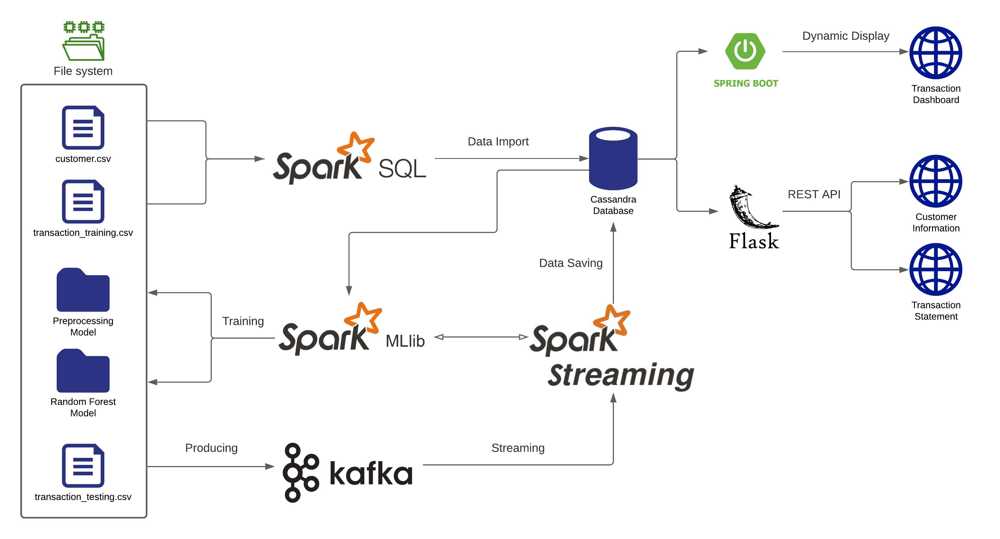
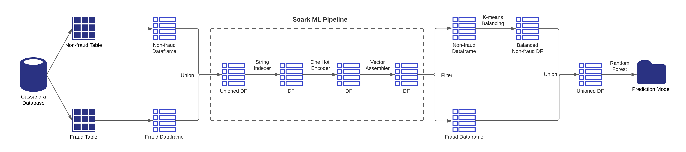
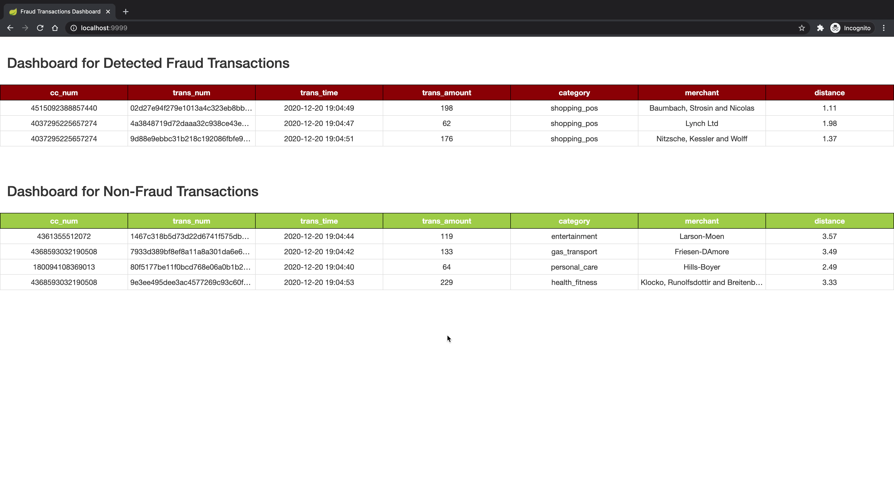
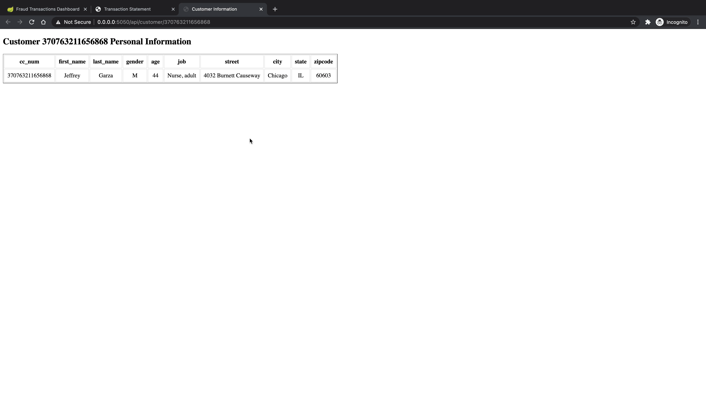
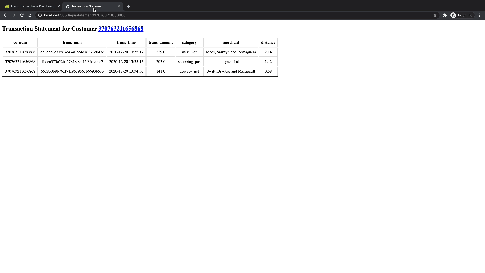

# Real-time Credit Card Fraud Detection Pipeline
## Workflow and Architecture
Following figure illustrates the workflow and architecture of the whole pipeline:


For the set-up part, I first simulate 100 customers' information and stored in the [`customer.csv`](./src/customer.txt) file, and over 10K transaction records stored in the `transaction_training.csv` file. Then, call a Spark SQL job to retrieve those data and import them into a Cassandra database. Next, run a Spark ML job to read the data from Cassandra, train on those data and create the models (Preprocessing and Random Forest) to classify the transaction records are fraud or not. 

After the models are saved to the file system, start a Spark Streaming job that would load the ML models and also consume credit card transactions from Kafka. Create a Kafka topic and produce transaction records from the `transaction_testing.csv` file as messages that would be consumed by the Spark Streaming job. And the streaming job would predict whether these transactions are fraud or not and then save them into the `fraud_transaction` and `non_fraud_transaction` tables separately based on the classification.

With the classified in-coming transaction records stored in the Cassandra database, I use the Spring Boot framework to display the frand and non-fraud transactions in real-time on the dashboard web page. Meanwhile, I also use the Flask framework to create two REST APIs that could easily retrieve the customer's information and create the transaction statement for each customer.

__A video demo for the workflow could be found here:__ https://youtu.be/fOVsxk16b0w


## Implementation Details
### Customers & Transactions dataset
Stimulate 100 customers using [Mockaroo](https://www.mockaroo.com/). For each record, it includes following columns (information):
- cc_num: credit card number which uniquely identify each card / customer
- first: customer's first name
- last: customer's last name
- gender: customer's gender
- street
- city
- state
- zip: zip code for the address above
- lat: latitude for the address above
- long: longitude for the address above
- job: customer's vocation
- dob: the date of birth for the customer

Also generate over 10K transaction records for these customers using the same way. For each record, it includes following columns (information):
- cc_num: credit card number which uniquely identify each card / customer
- first: customer's first name
- last: customer's last name
- trans_num: transaction number
- trans_date: transaction date
- trans_time: transaction time
- unix_time: transaction time in unix timestamp format
- category: category for the purchased item
- amt: transaction amount
- merchant: the place that the transaction happened
- merch_lat: latitude for the merchant
- merch_long: longitude for the merchant
- is_fraud: boolean to indicate the transaction is fraud or not

These transaction records would be later used as the training set and testing set with the splitting ratio as 80%.

### Spark ML job
First, run a Spark SQL job to retrieve the customers and transaction training data and import them into the Cassandra database. When importing the transactions data, the job also calculates two extra features `age` and `distance` where `age` is the age of each customer by the time the data are imported according to his/her date of birth; `distance` is the distance between the customer's address and the merchant's address by calculating the Euclidean distance between two places using the latitude & longitude information. All the training data (including two extra features) would be splitted and stored in the fraud table and non-fraud table separately based on whether each record is fraud or not.

Spark ML Job will load fraud and non-fraud transactions from fraud and non-fraud tables respectively. This will create 2 different dataframes in Spark. Next, these 2 dataframes are combined together using Union function, and Spark ML Pipeline Stages will be applied on this dataframe. 
- First, String Indexer will be applied to transform the selected columns into double values. Since the machine learning algorithm would not understand string values but only double values. 
- Second, One Hot Encoder will be applied to normalize these double values. The reason double values must be normalised is because machine-learning algorithm assumes higher the value better the category.
- Third, Vector Assembler is applied to assemble all the transformed columns into one column. This column is called a feature column. And the values of this column is a vector. This feature column will be given as input to the model creation algorithm. 

After assembling the feature column, then train the algorithm with this dataframe. However, currently data are not balanced, given that the number of non-fraud transactions is way larger than the number of fraud transactions. If such unbalanced data are used for training, then the algorithm would not create an accurate model. Hence, there is one more step needed to apply before training is to balance the data to enforce the number of non-fraud transactions must be almost equal to the number of fraud transactions. Here, the job uses the K-means algorithm to reduce the number of non-fraud transactions. After that, the job will combine both the dataframes and form a single dataframe as a balanced one. Then apply the Random Forest algorithm on this dataframe that uses the feature column for training and create the prediction/classification model. And finally, save the model to the filesystem.

Following figure illustrates the entire Spark ML job workflow:



### Kafka producer
Create a Kafka topic named as `creditcardTransaction` with 3 partitions. 
```
kafka-topics --zookeeper localhost:2181 --create --topic creditcardTransaction  --replication-factor 1 --partitions 3
```
The Kafka producer job would randomly select transactions from the transaction training dataset as messages and save the current timestamp into the messages as the transaction time. Later, these messages would be fed into the Spark Streaming job.


### Spark Streaming job
In the Spark Streaming job, it first starts by consuming credit card transaction messages from Kafka via the topic `creditcardTransaction`. Then, for each message, it reads customer data from Cassandra to compute age of the customer and calculate distance between merchant and customer place, since age and distance will be used as features in the prediction. After that, load both Preprocessing and Random Forest models that were created by Spark ML job. These 2 models will be used to transform and predict whether a transaction is fraud or not. Once the transactions are predicted, the records would be saved in the Cassandra database where fraud transactions will be saved to the fraud table and non-fraud transactions will be saved to the non-fraud table. Also each message would be offered a partition number and an offset number to indicate the location in the topic. These partition and offset information would be saved in the Kafka offset table to help to achieve exactly once semantics.


### Front-end dashboard
The front-end dashboard class is designed with Spring Bot framework that would select fraud and non-fraud transactions from Cassandra tables and display it on the dashboard in real-time. This method will call a select query to retrieve the latest fraud and non-fraud transactions that occurred in the last 5 seconds and display it on the dashboard. To display the record only once, the method maintains the max timestamp of previously displayed fraud/non-fraud transactions. And in the current trigger, it would only select those transactions whose timestamp is greater than the previous max timestamp.

Following screenshot illustrates a basic scenario of the dashboard interface:



### REST API for customers and transaction statements
I also design two REST APIs with the Flask framework to easily retrieve the customer information and create transaction statements for customers. They are all implemented by calling SQL queries to select records from the Cassandra non-fraud table.
- For customer information, the endpoint is: `/api/customer/<cc_num>` which would return basic information for the credit card `<cc_num>` owner.
- For creating a transaction statement for the specific customer, the endpoint is: `api/statement/<cc_num>` which would return all the transaction records for the credit card `<cc_num>` and order them by transaction time.

Following screenshots illustrate the examples of two API calls:


